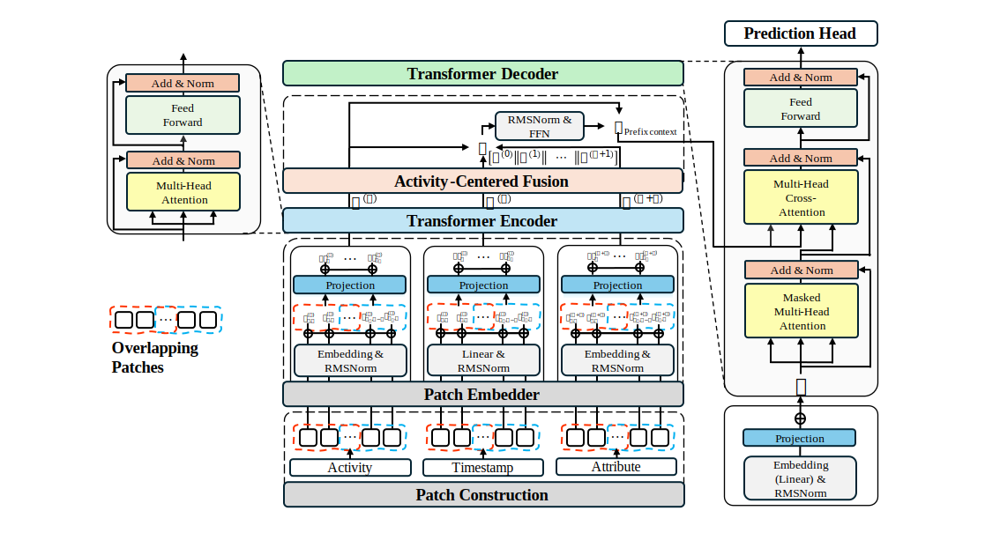

# PaCT: Patch-Based Multi-Channel Transformer for Predictive Process Monitoring

**Mingyun Kang, Yongjae Lee, Hyerim Bae**  
Pusan National University

PaCT is a patch-based multi-channel Transformer framework for Predictive Process Monitoring (PPM). Rather than treating a running trace as a flat sequence of events, PaCT segments each observed prefix into overlapping patches and encodes the activity, timestamp, and attribute channels with channel-independent Transformer encoders before activity-centered fusion. The resulting patch-level prefix context serves as the cross-attention input for a Transformer decoder that jointly performs three prediction tasks:

- **Next activity prediction**: accuracy
- **Suffix prediction**: normalized Damerau-Levenshtein similarity
- **Remaining time prediction**: MAE in days

Experiments on twelve real-life event logs show that PaCT is particularly effective for suffix and remaining time prediction.

## Architecture



```text
Prefix (activity, timestamp, attributes)
  -> Patch Construction (window w, stride floor(w / 2), tail-aligned)
      -> Patch Embedder (per-channel: token embedding + slot embedding + position embedding)
          -> Transformer Encoder (channel-independent, K + 2 channels)
              -> Activity-Centered Fusion (concat -> SwiGLU FFN -> residual add)
                  -> Transformer Decoder (causal self-attention + prefix cross-attention)
                      -> Head_act: next activity logits
                      -> Head_time: next-event time delta
                      -> Head_rem: remaining time
```

Training uses a multi-task objective: unweighted sum of cross-entropy for activity prediction, Huber loss for next-event time, and Huber loss for remaining time. Time targets are z-score normalized per training fold and converted back to days for evaluation.

## Default Hyperparameters

| Hyperparameter | Value |
|---|---|
| Patch size `w` | 4 |
| `d_model` | 64 |
| `d_emb` | 32 |
| Attention heads | 4 |
| Encoder / decoder layers | 2 / 2 |
| Feed-forward dim `d_ff` | 128 |
| Dropout | 0.1 |
| Optimizer | AdamW, lr = 3e-4, cosine annealing |
| Training epochs | 30, early stopping patience 8 |
| Batch size | 128 |

## Benchmark Datasets

Twelve real-life event logs from Rama-Maneiro et al. (2022). Logs with categorical attributes are evaluated in two modes: **PaCT** (activity-only, `wo_attr`) and **PaCT\*** (with attributes, `w_attr`).

| Dataset | #Cases | #Activities | Avg. length | #Attributes |
|---|---:|---:|---:|---:|
| BPIC12 | 13,087 | 36 | 20.0 | - |
| BPIC12 A | 13,087 | 10 | 4.7 | 1 |
| BPIC12 Complete | 13,087 | 23 | 12.6 | - |
| BPIC12 O | 5,015 | 7 | 6.2 | 1 |
| BPIC12 W | 9,658 | 19 | 17.6 | - |
| BPIC12 W Complete | 9,658 | 6 | 7.5 | - |
| BPIC13 Closed | 1,487 | 7 | 4.5 | 2 |
| BPIC13 Incidents | 7,554 | 13 | 8.7 | 4 |
| Env Permit | 1,434 | 27 | 6.0 | 2 |
| Helpdesk | 4,580 | 14 | 4.7 | 1 |
| Nasa | 2,566 | 94 | 28.7 | - |
| Sepsis | 1,049 | 16 | 14.5 | 1 |

## Project Layout

```text
PaCT/
  main.py                       # Entry point delegating to experiment.run_experiment
  experiment.py                 # KFold orchestration, CSV I/O, checkpointing, evaluation
  contracts.py                  # PaCTBatch / PaCTOutput dataclasses
  model/
    compo.py                    # Patch embedding, encoders, decoder, heads
    model.py                    # PaCT estimator, PaCTNet, training loop
  utils/
    config.py                   # Dataset attribute config and file-key mappings
    data_io.py                  # XES loading, caching, dataset construction
    dataset.py                  # PaCTDataset, TimeNormalizer, length-bucket sampling
    metrics.py                  # Damerau-Levenshtein distance and suffix similarity
  scripts/
    figures/
      make_figures.py           # Patch-size sensitivity figure
  figures/
    fig1_architecture.svg       # Fig. 1 architecture diagram
  data/
    benchmark/                  # 12 benchmark XES / XES.GZ event logs
  result/
    benchmark/pact/             # Pre-generated benchmark result CSVs
    cache/pact/                 # Parsed XES caches (gitignored)
    figures/                    # Generated SVG figures
```

## Setup

Requires Python 3.12. CUDA is recommended for the full benchmark; CPU execution is supported but slow.

Using `uv`:

```powershell
uv venv
uv pip install -e .
```

Using standard pip:

```powershell
python -m venv .venv
.\.venv\Scripts\python -m pip install -e .
```

## Run

Run the full benchmark:

```powershell
python .\main.py
```

Run on selected datasets:

```powershell
python .\main.py --datasets Helpdesk.xes.gz SEPSIS.xes.gz
```

Run the patch-size ablation with a selected patch size:

```powershell
python .\main.py --prefix_patch_size 4
```

Force attribute mode:

```powershell
python .\main.py --prefix_mode_override w_attr
python .\main.py --prefix_mode_override wo_attr
```

All CLI options:

| Option | Default | Description |
|---|---|---|
| `--datasets` | all | Filenames to run, e.g. `Helpdesk.xes.gz` |
| `--prefix_patch_size` | 1 | Patch window size `w` |
| `--prefix_mode_override` | `auto` | `auto`, `w_attr`, or `wo_attr` |
| `--n_splits` | 5 | Number of KFold splits |
| `--val_ratio` | 0.2 | Fraction of training fold used for validation |
| `--min_prefix_len` | 1 | Minimum prefix length included in evaluation |
| `--seed` | 42 | Random seed |
| `--eval_batch_size` | 64 | Batch size used during inference |

## Outputs

Runtime benchmark CSVs are written to:

```text
result/<dataset>/results.csv
```

Each CSV contains one row per fold plus `mean` and `std` summary rows with columns:
`dataset`, `prefix_mode`, `prefix_patch_size`, `fold`, `next_activity_accuracy`, `suffix_dl_similarity`, `remaining_time_mae_days`, `next_time_mae_days`, `n_test_cases`, `n_test_pairs`, `train_time_sec`, and `inference_time_sec`.

Parsed XES caches are written to `result/cache/pact/`. Pre-generated results from the paper are in `result/benchmark/pact/`.

Reproduce the patch-size sensitivity figure:

```powershell
python .\scripts\figures\make_figures.py
```

The SVG is saved to `result/figures/`.

## Citation

```bibtex
@inproceedings{kang2026pact,
  title     = {{PaCT}: Patch-Based Multi-Channel Transformer for Predictive Process Monitoring},
  author    = {Kang, Mingyun and Lee, Yongjae and Bae, Hyerim},
  booktitle = {Proceedings of ...},
  year      = {2026}
}
```
